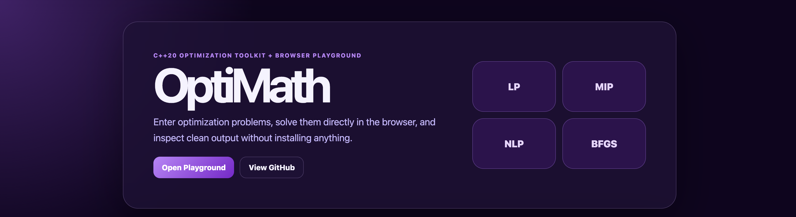
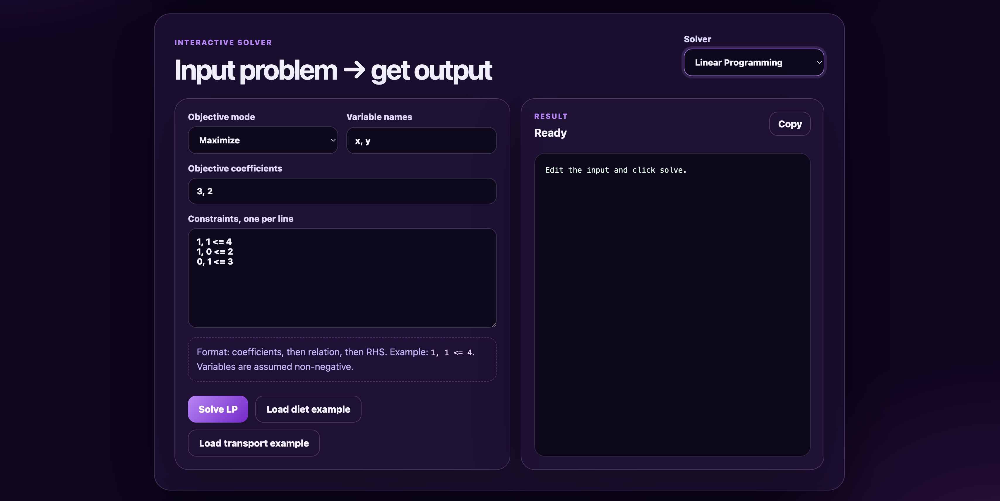

# OptiMath

OptiMath is a dependency free **C++20 optimization toolkit** for learning, experimenting, and building small optimization workflows from first principles.

It currently includes:

- **Linear programming (LP)** with a two phase primal simplex solver
- **Mixed integer optimization (MILP style)** using branch and bound over LP relaxations
- **Nonlinear optimization (NLP)** with BFGS quasi-Newton minimization
- **Constrained NLP** through a quadratic penalty wrapper
- A small **CLI app** with runnable demo problems
- Lightweight **unit tests** and **GitHub Actions CI**

This project is a good fit for educational use, prototyping, and understanding solver internals without pulling in large external dependencies.

## Preview






## Features

- C++20, CMake-based build
- No third-party runtime dependencies
- Two-phase simplex with support for `<=`, `>=`, and `=` constraints
- Branch-and-bound for integer-constrained variables
- BFGS with analytic gradients or finite-difference fallback
- Penalty-based handling for equality and inequality constraints
- Example optimization demos exposed through `optimath_cli`
- Test suite for LP and NLP components


## Web Frontend

OptiMath now includes a static browser playground in `public/` for deployment on Vercel or any static host. It lets users enter inputs and view outputs for:

- Linear programming problems with `<=`, `>=`, and `=` constraints
- 0/1 knapsack problems
- Rosenbrock minimization with a JavaScript BFGS demo

Run it locally by opening `public/index.html` in a browser, or serve it with any static server:

```bash
python3 -m http.server 8080 -d public
```

Then open:

```text
http://localhost:8080
```

For Vercel, this repo uses `vercel.json` to publish the `public` folder with no build command.

## Project Structure

```text
OptiMath/
├── README.md
├── LICENSE
├── CMakeLists.txt
├── vercel.json
├── .gitignore
├── .mailmap
├── .github/
│   └── workflows/
│       └── ci.yml
├── apps/
│   └── optimath_cli.cpp
├── docs/
│   └── ALGORITHMS.md
├── images/
│   ├── optimath-preview-1.png
│   ├── optimath-preview-2.png
│   └── optimath-preview-3.png
├── public/
│   ├── index.html
│   ├── styles.css
│   └── app.js
├── include/
│   └── optimath/
│       ├── core/
│       │   ├── options.hpp
│       │   ├── result.hpp
│       │   ├── status.hpp
│       │   └── timer.hpp
│       ├── linalg/
│       │   ├── matrix.hpp
│       │   ├── solve.hpp
│       │   └── vector.hpp
│       ├── lp/
│       │   ├── linear_program.hpp
│       │   ├── mip_branch_and_bound.hpp
│       │   └── simplex.hpp
│       └── nlp/
│           ├── bfgs.hpp
│           ├── objective.hpp
│           └── penalty.hpp
├── src/
│   ├── core/
│   │   ├── status.cpp
│   │   └── timer.cpp
│   ├── linalg/
│   │   ├── matrix.cpp
│   │   ├── solve.cpp
│   │   └── vector.cpp
│   ├── lp/
│   │   ├── linear_program.cpp
│   │   ├── mip_branch_and_bound.cpp
│   │   └── simplex.cpp
│   └── nlp/
│       ├── bfgs.cpp
│       ├── objective.cpp
│       └── penalty.cpp
└── tests/
    ├── test_main.cpp
    ├── test_common.hpp
    ├── test_lp_simplex.cpp
    ├── test_nlp_bfgs.cpp
    └── public_app_test.mjs
```

## Requirements

- **CMake 3.20+**
- A **C++20-compatible compiler**
  - GCC 11+
  - Clang 14+
  - MSVC with C++20 support

## Build

### macOS / Linux

```bash
cmake -S . -B build -DOPTIMATH_BUILD_APPS=ON -DOPTIMATH_BUILD_TESTS=ON
cmake --build build -j
```

### Windows (Developer PowerShell)

```powershell
cmake -S . -B build -DOPTIMATH_BUILD_APPS=ON -DOPTIMATH_BUILD_TESTS=ON
cmake --build build --config Release
```

## Run Tests

```bash
ctest --test-dir build --output-on-failure
```

The current test suite covers:

- LP simplex correctness on basic bounded problems
- Phase-I handling for `>=` constraints
- BFGS convergence on Rosenbrock minimization
- Penalty-based constrained optimization behavior

## CLI Demos

When apps are enabled, the build produces `optimath_cli`.

### Show Help

```bash
./build/optimath_cli --help
```

### List Available Demos

```bash
./build/optimath_cli --list
```

Current demos:

- `lp:diet`
- `lp:transport`
- `mip:knapsack`
- `nlp:rosenbrock`
- `nlp:curvefit`
- `nlp:portfolio`

### Run Examples

```bash
./build/optimath_cli lp:diet
./build/optimath_cli lp:transport
./build/optimath_cli mip:knapsack
./build/optimath_cli nlp:rosenbrock
./build/optimath_cli nlp:curvefit --max-it 200000 --primal-tol 1e-6
./build/optimath_cli nlp:portfolio
```

### Example Output

`lp:diet`

```text
Status: OK
Min cost (objective): 10.000000
  oats = 5.000000
  milk = 0.000000
  eggs = 0.000000
Pivots: 2
```

`nlp:rosenbrock`

```text
Status: OK
Objective: 0.000000000000
x: [0.999999999215, 0.999999998428]
Iterations: 2283
```

## Solver Options

The CLI exposes a few runtime controls that map to `optimath::core::SolverOptions`:

```bash
./build/optimath_cli <demo> [--verbose] [--max-it N] [--time-limit S] [--primal-tol X] [--dual-tol X]
```

Available options:

- `--verbose` enable more detailed solver output where supported
- `--max-it N` cap solver iterations
- `--time-limit S` set a time limit in seconds
- `--primal-tol X` primal feasibility tolerance
- `--dual-tol X` dual feasibility tolerance

## Library Overview

### Linear Programming

The LP module models problems in the form:

- maximize `c^T x`
- subject to linear constraints using `<=`, `>=`, or `=`

Core types:

- `optimath::lp::LinearProgram`
- `optimath::lp::ConstraintSense`
- `optimath::lp::solve_simplex(...)`

Minimal example:

```cpp
#include "optimath/lp/linear_program.hpp"
#include "optimath/lp/simplex.hpp"

using optimath::lp::ConstraintSense;

optimath::lp::LinearProgram lp(2);
lp.set_objective({3.0, 2.0});
lp.add_constraint({1.0, 1.0}, 4.0, ConstraintSense::kLessEqual);
lp.add_constraint({1.0, 0.0}, 2.0, ConstraintSense::kLessEqual);
lp.add_constraint({0.0, 1.0}, 3.0, ConstraintSense::kLessEqual);

auto res = optimath::lp::solve_simplex(lp);
```

### Integer Optimization

The integer optimization layer performs branch-and-bound on top of LP relaxations.

Core types:

- `optimath::lp::MIPModel`
- `optimath::lp::solve_branch_and_bound(...)`

You provide:

- an LP relaxation
- a list of variable indices that must take integer values

### Nonlinear Optimization

The NLP module supports unconstrained minimization with BFGS.

Core types:

- `optimath::nlp::Objective`
- `optimath::nlp::LambdaObjective`
- `optimath::nlp::minimize_bfgs(...)`

If an analytic gradient is not supplied, finite differences are used.

### Constrained NLP

Constrained problems are handled with a quadratic-penalty wrapper.

Core API:

- `optimath::nlp::minimize_with_penalty(...)`
- `optimath::nlp::InequalityConstraint`
- `optimath::nlp::EqualityConstraint`

## Algorithms

Algorithm notes are documented in [`docs/ALGORITHMS.md`](docs/ALGORITHMS.md).

Current implementations include:

- **Two-phase primal simplex** for LP
- **Branch-and-bound** for integer-constrained optimization
- **BFGS quasi-Newton** for smooth unconstrained problems
- **Quadratic penalty method** for constrained NLP

## CI

The repository includes a GitHub Actions workflow at `.github/workflows/ci.yml` that:

- configures the project with CMake
- builds the library, tests, and CLI
- runs the test suite on push and pull request events

## Limitations

This project is intentionally lightweight and educational. At the moment:

- LP is modeled as a **maximization** API; minimization examples are expressed by negating the objective
- The integer layer enforces **integrality by variable index**, but does not yet provide richer modeling helpers like native binary-variable bounds or advanced cuts
- There is no sparse linear algebra backend
- There is no file-based model format or parser yet
- Performance is designed for clarity over industrial-scale optimization workloads

## Roadmap Ideas

Good next improvements for the project would be:

- variable bounds and explicit binary-variable helpers
- presolve and scaling improvements for LP
- better branching heuristics and incumbent strategies
- sparse matrix support
- benchmark suite and profiling tools
- import/export for common model formats
- more example problems and API docs

